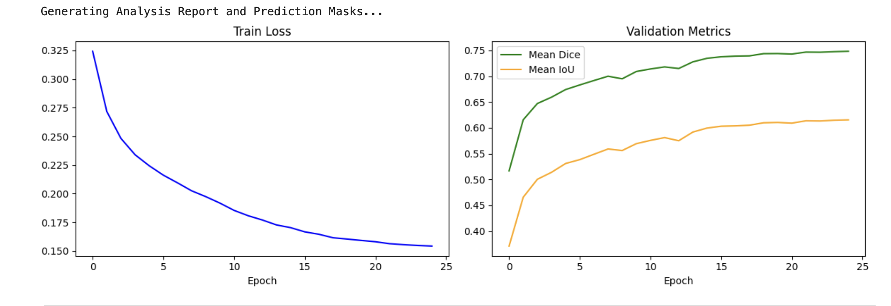
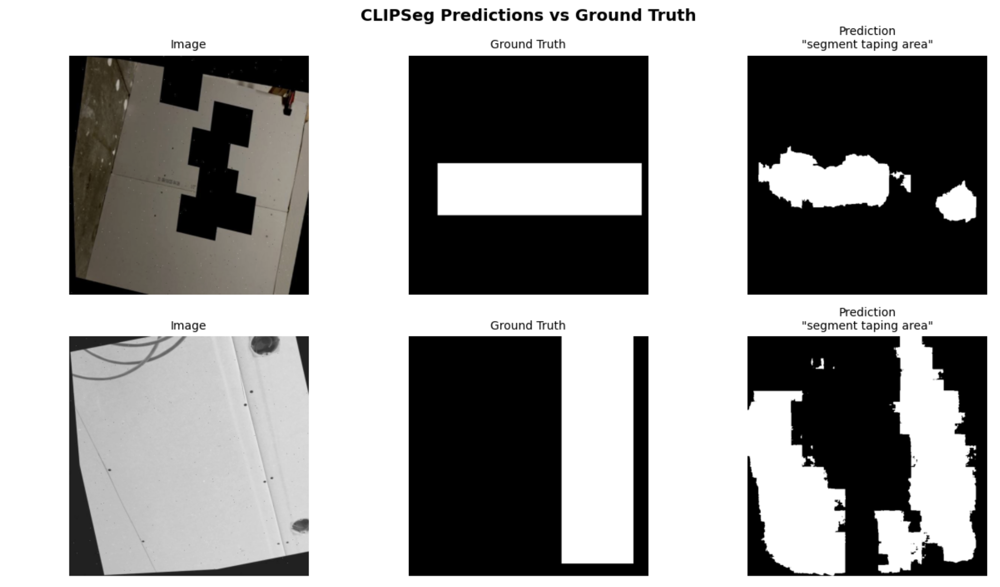
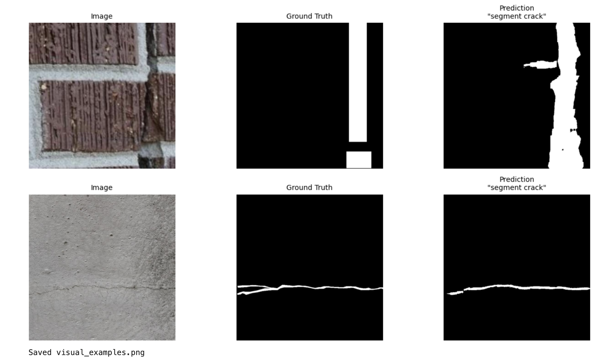

# Prompted Segmentation for Drywall QA 🏗️


## 📖 Table of Contents
1. [Project Overview & Motivation](#1-project-overview--motivation)
2. [Data Pipeline & Engineering](#2-data-pipeline--engineering)
3. [Model Architecture & Training Strategy](#3-model-architecture--training-strategy)
4. [Advanced Loss Function Engineering](#4-advanced-loss-function-engineering)
5. [Dynamic Threshold Optimization](#5-dynamic-threshold-optimization)
6. [Results & Evaluation](#6-results--evaluation)
7. [Error Analysis (Edge Cases)](#7-error-analysis-edge-cases)
8. [Hardware Profiling](#8-hardware-profiling)
9. [Installation & Inference Runbook](#9-installation--inference-runbook)
10. [Reproducibility](#10-reproducibility)

---

## 1. Project Overview & Motivation
Traditional Quality Assurance (QA) in construction relies on manual inspection or highly rigid, fixed-class computer vision models (e.g., Mask R-CNN or U-Net trained exclusively on "cracks"). 

This project implements a **text-conditioned multimodal segmentation system**. By feeding the model an image of a drywall surface alongside a natural language prompt, the model dynamically generates a binary mask targeting the requested defect. This allows a single model to handle diverse QA tasks simply by changing the text prompt.

**Current Supported Prompts:**
* **Taping/Mudding:** `"segment taping area"`, `"segment joint/tape"`, `"segment drywall seam"`
* **Defects:** `"segment crack"`, `"segment wall crack"`

---

## 2. Data Pipeline & Engineering
The project fuses two distinct domain datasets from Roboflow:
1. **[Drywall-Join-Detect](https://universe.roboflow.com/objectdetect-pu6rn/drywall-join-detect):** Contains polygon and bounding box annotations for wet/dry mudding tape.
2. **[Cracks-3ii36](https://universe.roboflow.com/fyp-ny1jt/cracks-3ii36):** Contains fine-grained polygon annotations for hairline wall fractures.

### Data Balancing & Caching
Because the taping dataset contained significantly more instances than the crack dataset, a naive combination would result in severe class imbalance.
* **Oversampling Strategy:** We calculated a dynamic multiplier to oversample the `cracks_train` subset to match the volume of `taping_train`, ensuring the model sees an equal distribution of text prompts during training.
* **In-Memory Caching:** To prevent I/O bottlenecks during GPU training, the entire dataset is parsed from COCO JSON format, converted into `352x352` masks, and cached directly in RAM via a custom `DrywallDatasetDynamicRAM` PyTorch Dataset.

**Final Data Split:**
* **Training Data:** 4,579 images
* **Validation Data:** 906 images
* **Test Data:** 906 images

### Image Augmentation (`Albumentations`)
To ensure robustness against varied construction site lighting, we applied the following augmentation pipeline during training:
* `HorizontalFlip(p=0.5)`
* `VerticalFlip(p=0.2)`
* `RandomBrightnessContrast(p=0.2)`
* Normalization using CLIP's standard ImageNet mean/std matrices.

---

## 3. Model Architecture & Training Strategy
**Base Model:** `CLIPSeg` (`CIDAS/clipseg-rd64-refined`)

CLIPSeg modifies the standard CLIP architecture by adding a transformer-based decoder. It projects text and visual embeddings into the same latent space, allowing the decoder to generate spatial probability maps based on text-image alignment.

### Fine-Tuning Strategy
We utilized **Differential Learning Rates** to preserve semantic knowledge while adapting to the visual domain:
1. **Text Encoder (63.2M Params):** Strictly **Frozen** (`requires_grad = False`). We do not want the model to forget what the English word "crack" means.
2. **Vision Encoder (CLIP ViT):** Fine-tuned with a highly conservative learning rate (`lr = 3e-6`).
3. **Decoder:** Actively trained with a standard learning rate (`lr = 3e-4`) to learn the precise spatial boundaries of drywall defects.

**Optimizer & Scheduler:**
Trained using `AdamW` (weight decay `1e-4`) coupled with a `CosineAnnealingLR` scheduler over 25 epochs, preceded by a 3-epoch linear warmup phase. Training was accelerated using PyTorch Automatic Mixed Precision (`autocast` to `fp16`).

---

## 4. Advanced Loss Function Engineering
Hairline cracks often occupy less than 1% of the total image pixels. Standard Binary Cross-Entropy (BCE) loss would cause the model to achieve 99% accuracy by simply predicting an entirely black background. 

To solve this, we engineered a custom mixed loss function:
* **40% Focal Loss ($\gamma = 2.0, \alpha=0.75$):** Down-weights the loss contribution of "easy" background pixels, forcing the network to focus on the hard-to-classify pixels at the edges of the defects.
* **60% Tversky Loss ($\alpha = 0.3, \beta=0.7$):** A generalization of the Dice coefficient. By setting $\beta > \alpha$, we penalize **False Negatives** more heavily than False Positives. This is crucial for QA, where missing a crack is far more dangerous than accidentally classifying a shadow as a crack.

---

## 5. Dynamic Threshold Optimization
Segmentation models output a probability matrix (0.0 to 1.0), which must be binarized into a mask (0 or 255). Many pipelines hardcode a threshold of `0.5`. 

Instead, at the end of every epoch, our validation loop performs a **Threshold Sweep**. It tests thresholds from `0.15` to `0.85` (in steps of `0.05`) against the validation set. The checkpoint is only saved if the combined mean of the mIoU and Dice scores improves at the newly discovered optimal threshold. 
* *Result:* The model's optimal confidence threshold naturally settled at **0.80**, indicating high confidence in its predictions.

---

## 6. Results & Evaluation
Evaluated at **Epoch 25** using the dynamically optimized binarization threshold of **0.80**.

| Target Feature | Prompt Used | Validation mIoU | Validation Dice |
| :--- | :--- | :---: | :---: |
| **Taping Area** | `"segment taping area"` | 0.6714 | 0.7960 |
| **Wall Cracks** | `"segment crack"` | 0.5593 | 0.7003 |
| **OVERALL** | *(Average)* | **0.6153** | **0.7482** |

* *Final:* Best Val Score is 0.6818 (Avg of mIoU & Dice) and best threshold is 0.80 


### Training Convergence


### Visual Inference Examples



---

## 7. Error Analysis (Edge Cases)
While the model achieved a high Dice score, qualitative analysis reveals a few specific failure modes:
1. **Hairline Fragmentation:** Extremely faint, low-contrast cracks are occasionally predicted as dashed/fragmented lines rather than continuous solid masks. The Tversky loss mitigated this, but sub-pixel cracks still struggle.
2. **Harsh Shadows (False Positives):** Deep surface scratches or gouges casting sharp, directional shadows can sometimes trigger a false positive for the `"segment crack"` prompt.
3. **Flash Glare (False Negatives):** Direct camera flash reflecting off fresh, wet drywall mud occasionally causes spatial gaps in the predicted taping area mask.

---

## 8. Hardware Profiling
The model is optimized for edge-server deployment or rapid batched inference.

| Metric | Measurement |
| :--- | :--- |
| **Checkpoint Disk Size** | 603.2 MB |
| **Total Parameters** | 150.7M |
| **Trainable Parameters** | 87.6 M (Vision + Decoder) |
| **Frozen Parameters** | 63.2 M (Text Encoder) |
| **Avg Inference Speed** | **38.6 ms / image** (~38 FPS on Kaggle NVIDIA P100/T4) |

---

## 9. Installation & Inference Runbook

### Prerequisites
```bash
pip install torch torchvision transformers albumentations pillow numpy tqdm matplotlib
```
---

## 10. Reproducibility & Environment Setup

To ensure exact mathematical replication of the training curves, loss distributions, and dataset splits, global seeds have been rigidly locked across the entire pipeline. Due to the nature of GPU-accelerated training, we also enforce deterministic algorithms in PyTorch to prevent run-to-run variations.

### Global Seed Initialization
Place this block at the very top of your training and inference scripts, before any data loading or model initialization:

```python
import os
import random
import numpy as np
import torch

SEED = 42

def seed_everything(seed=42):
    # Core Python & Numpy
    random.seed(seed)
    os.environ['PYTHONHASHSEED'] = str(seed)
    np.random.seed(seed)
    
    # PyTorch Base
    torch.manual_seed(seed)
    
    # PyTorch CUDA & CuDNN
    if torch.cuda.is_available():
        torch.cuda.manual_seed(seed)
        torch.cuda.manual_seed_all(seed)
        # Enforce deterministic convolutions (slightly slower, but perfectly reproducible)
        torch.backends.cudnn.deterministic = True
        torch.backends.cudnn.benchmark = False

seed_everything(SEED)
```

---

## Contributing

I welcome contributions to this project! Whether it's reporting a bug, suggesting a new feature, improving documentation, or submitting code, your help is highly appreciated.


---


## Contact

For any questions or collaborations, please reach out at amansinghbudhala15@gmail.com

---

